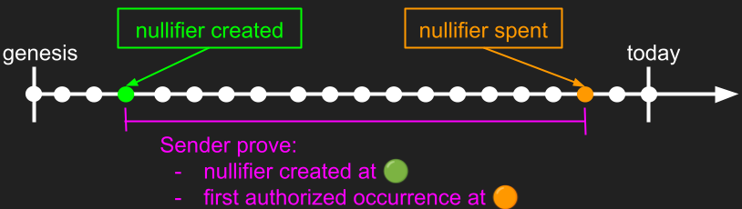
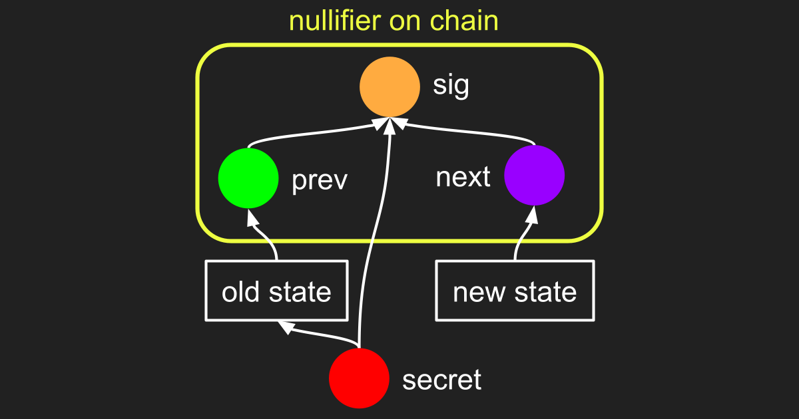

# Insights for Shielded CSV from Tachyon

Gus Gutoski, 2026-04-07

---

# Executive summary

- Every node in a Shielded CSV network must maintain the ever-growing full history of nullifiers in "hot" storage. This represents an unacceptable burden on the network.
- Zcash has a similar problem. A new proposal called Tachyon aims to solve this problem for Zcash. Tachyon can solve this problem for Shielded CSV, too.
- Shielded CSV nullifiers are based on Schnorr signatures, which are quantum-vulnerable. This is an unacceptable security risk for the protocol.
- Zcash nullifiers are based on hash functions, which are quantum-safe. Moreover, hash-based nullifiers are more efficient for Tachyon than Schnorr-based nullifiers.
- Shielded CSV's Schnorr-based nullifier consumes only 64 bytes (amortized) on chain, after aggregation. This article proposes a hash-based nullifier for Tachyon-enhanced Shielded CSV that consumes 48 bytes on chain, with no aggregation, under an aggressive parameter choice. A conservative parameter choice consumes 96 bytes on chain.
- **Hot take:** Shielded CSV and Zcash will eventually converge to the same protocol.

# Target audience

This article is written for an advanced audience. The following background is assumed:

- How Bitcoin works at a conceptual level.
- Familiarity with the [Shielded CSV paper](https://eprint.iacr.org/2025/068) and at least a partial understanding of it.
- Awareness of Zcash and [Tachyon](https://seanbowe.com/blog/tachyon-scaling-zcash-oblivious-synchronization/).

Discussion is conceptual and informal. This article is not a detailed specification or a rigorous white paper.

New to Shielded CSV? Check out this [video presentation by Jonas Nick](https://www.youtube.com/watch?v=aZa2zXp1Q2A).

# The nullifier full history problem

## What is nullifier full history?

In order to receive a Shielded CSV transaction, the protocol assumes that the receiver already knows the following:

- **Authority to spend.** The sender is authorized to consume the on-chain nullifier corresponding to the transaction.
- **Unspent status.** The nullifier was not already consumed by a previous transaction.

The protocol allows the receiver to learn this information from the following sources:

- **Proof of authority.** Each on-chain nullifier is identified by a unique public key `pk` and includes a signature valid for `pk`, which demonstrates authority to consume the nullifier.
- **Proof of unspent status.** The receiver is convinced that the nullifier identified by `pk` is not already consumed by checking the history of the blockchain for a previous occurrence of `pk` with a valid signature.

Unfortunately, the best known way for the receiver to distill the needed information from the above sources is to maintain an ever-growing database of all nullifiers ever posted to the blockchain. This is exactly what the Shielded CSV protocol instructs the receiver to do. This requirement is referred to here as the _nullifier full history_ problem.

## How bad is nullifier full history?

In order for Shielded CSV to match Bitcoin's modest throughput of only 10 transactions per second, its nullifier database must grow by 864k entries (more than 50MB) each day, forever. Each time a node receives a transaction, it must execute a membership query against this database. Thus, the entire database must be maintained in "hot" storage capable of servicing these queries, and the cost to receive a transaction grows in direct proportion to the size of the history. Moreover, as the throughput of the network scales beyond Bitcoin's 10 transactions per second, the _rate of growth_ of this cost grows in direct proportion to that increase in throughput. That is a significant burden.

Compare: in Bitcoin, nodes need not store the entire history of the blockchain. Bitcoin's UTXO set must be kept in hot storage, but the size of this set is not tethered to the size of the blockchain's history or any other ever-growing quantity. In practice, the UTXO set tends to scale only sub-linearly with the size of Bitcoin's blockchain, and sometimes it can even shrink.

One could argue that the burden of Shielded CSV's nullifier full history is acceptable. Regardless, the utility of Shielded CSV could be significantly improved by eliminating the need for nullifier full history, even at the cost of some new tradeoffs.

The experience of Zcash is relevant here. Zcash, like Shielded CSV, has a nullifier full history problem of its own. The problem is severe enough for Zcash that researchers are currently developing a solution called _Tachyon_. Shielded CSV has enough in common with Zcash that insights from Tachyon can yield practical improvements for Shielded CSV as well.

# The Tachyon solution: senders prove their nullifiers

Zcash's Tachyon proposal embodies a simple idea: the sender proves to the receiver the validity of their nullifiers. This idea is a foundational change for Zcash, yet it is also consistent with Shielded CSV's client-side validation principle.

The goal is to eliminate the need for full nullifier history. To build confidence that this goal is achievable at reasonable cost, consider the following analysis.

## How to prove authority to spend

Consider first a simplified review of how the receiver verifies a nullifier in Shielded CSV as it exists today. Recall that each on-chain nullifier in Shielded CSV (before optimizations are applied) is a triple `(pk,sig,tx_hash)` where `sig` is a signature of `tx_hash` that is valid for `pk`. Upon receipt of the new nullifier from the sender, the receiver is expected to scan the nullifier full history for prior occurrences of `pk`. For each such occurrence, the receiver verifies the accompanying `sig`. If any of these verifications succeed then the receiver concludes that the nullifier was already consumed for a different transaction in the past, so the nullifier is rejected as a double-spend attempt by the sender. Otherwise, the receiver accepts the nullifier as valid.

Tachyon's design principle is to migrate this algorithm from native computation done by the receiver into proof-carrying data (PCD) computation done by the sender. This is easy to state at a conceptual level, though the actual migration is a significant engineering challenge.

## How to prove unspent status

A naive application of Tachyon might instruct the sender to compute a proof that they have executed a search through the blockchain's history for their nullifier, and that this search returned no prior spends. This approach is a dead end because it does not eliminate the need for full nullifier history---it merely shifts the burden from receiver to sender.

Fortunately, the sender has some additional information about their nullifier that the receiver lacks: its birth date. The sender can exploit this knowledge to avoid requiring the proof to extend all the way back to genesis. Instead, the sender proves only that the nullifier was not consumed between its birth date and the current transaction.

The following diagram illustrates this idea:

This idea eliminates the need for anyone to support nullifier full history, which is a clear improvement. However, it imposes a large new workload upon the sender. Consider: the sender must now prove---for each new nullifier `n` in each new block that appears after the birth of their nullifier---that `n` does not consume their nullifier. That workload is substantial, particularly when the blockchain has high throughput or the nullifier is old.

Tachyon proposes two strategies to mitigate this workload:

- Incremental proof maintenance
- Outsource expensive proofs

## Incremental proof maintenance

It is infeasible to expect the sender to wait until they are ready to consume a nullifier before beginning the work to create a proof. Instead, proof creation should begin immediately at the nullifier's birth. Specifically, with each new block added to the chain, the sender updates their proof against this new block. At any point in time, the sender's proof is never more than one block old, so the remaining work required to finish the proof at spend time is much more tractable.

The protocol must be designed to allow for this style of incremental proof formation. Fortunately, Shielded CSV already has everything required. The protocol already relies upon a PCD scheme for other reasons. This PCD scheme can be re-used for maintenance of nullifier proofs.

## Incremental proof maintenance is still expensive

Incremental maintenance is a significant improvement upon an all-at-once proof, but it is probably not good enough by itself. The workload required from a client to update their nullifier proof for even just a single block is still significant, and this workload is refreshed with each new block. Not only must users "drink from the firehose of the blockchain," they must also maintain a PCD proof of that firehose.

Moreover, this workload is duplicated for each distinct unspent nullifier the client wishes to maintain. Fortunately, the Shielded CSV design pushes nullifiers from the UTXO level up to the account level. Whereas an individual user might control hundreds of Bitcoin-style UTXOs, that same user is expected to have only a small number of separate accounts in Shielded CSV. Thus, while the problem of duplicated workload for multiple nullifiers is significant, it is not as prohibitive as it might initially appear to an audience accustomed to thinking in terms of UTXOs rather than accounts.

One could argue that if block frequency and size are sufficiently low then this continuous workload might be feasible on higher-end consumer hardware with reliable connectivity to the internet. Even so, less-demanding resource requirements for users remain a worthwhile goal.

## Outsource expensive proofs

Tachyon's solution to this problem is to allow for the ability to outsource the maintenance of nullifier proofs to third-party services. Such an idea is viable only if users can maintain their privacy while using the service. Beyond mere relief from computational workload, a well-designed marketplace for nullifier proofs should satisfy the following properties:

- The marketplace should be competitive with low barriers to entry so that most of the surplus is captured by users.
- Users should not be forced to commit to a specific provider up-front, or suffer involuntary vendor lock-in.

There is no fundamental barrier against these goals. Care must be taken, however, to design the protocol in such a way as to create a stable equilibrium with the desired properties. Shielded CSV's existing marketplace for aggregation of nullifiers may serve as a useful reference.

The details of a scheme to outsource expensive proofs are outside the scope of this article. Any solution that works for Tachyon could likely be adapted for Shielded CSV as well. See [A note on notes](https://eprint.iacr.org/2025/2031) for an example of recent work on this topic.

# Why is a Shielded CSV nullifier built on signatures?

Now that nullifier verification has been migrated from native computation into a PCD computation, it makes sense to re-evaluate whether a signature is the right cryptographic primitive to use in these new Tachyon-enhanced nullifiers.

To that end, consider first why the designers of Shielded CSV opted for signatures in the first place. The choice may seem surprising at first, given that Zcash uses a hash output rather than a signature as a nullifier. The answer, as best as can be determined, rests on the requirement that Shielded CSV expects the receiver to validate every nullifier in the full history using only on-chain data with no additional help from the sender. Moreover, at a bare minimum, a nullifier must contain three distinct pieces of information on chain:

- The sender's existing unspent account state.
- The new transaction that spends (consumes) that state.
- A proof of authority to spend that cryptographically binds the previous two items.

Thus, the task "validate a nullifier" means "validate these three pieces of information".

A signature is essentially a special-purpose proof that is well-suited to this use case. Schnorr signatures are very small and fast in native computation, and the three components of a signature---public key, message, and signature---map perfectly onto the three components of a nullifier:

- Public key <-> unspent account state.
- Message <-> the `tx_hash` that consumes the state.
- Signature <-> proof of authority to spend, binds the previous two items.

After applying a so-called "sign-to-contract" optimization, each nullifier in Shielded CSV has an on-chain footprint of only 96 bytes. This size can be further improved via Schnorr half-aggregation, after which the amortized size of each nullifier approaches 64 bytes. That is an impressive achievement, and much smaller than an ordinary Bitcoin transaction.

# What's wrong with Schnorr signatures?

Overall, the Schnorr signature scheme is a good fit for Shielded CSV. However, it is not without cost.

## Vulnerability to quantum computers

The threat posed by a cryptographically relevant quantum computer to infrastructure (such as Bitcoin) that relies on quantum-vulnerable cryptography (such as Schnorr) is assumed to be familiar to the reader.

The most salient use of quantum-vulnerable cryptography in Shielded CSV is its use of Schnorr in the nullifier. This use of Schnorr was carefully designed to optimize the on-chain footprint of a nullifier. Unfortunately, the benefits of Schnorr must be sacrificed now in order to avoid a much more expensive migration in the future.

There is much more to say about the quantum-safety of Shielded CSV. That discussion is outside the scope of this article.

## Schnorr is suboptimal in PCD

Verification of a Schnorr signature requires a scalar multiplication over an elliptic curve. This operation is expensive relative to other options, even when the Schnorr signatures in the protocol are defined over a curve whose group order is chosen to coincide with the native field of the PCD.

As usual, the experience of Zcash is directly relevant here. Zcash's Sapling upgrade introduced a nullifier whose verification requires an elliptic curve scalar multiplication, similar to Shielded CSV. Zcash's subsequent Orchard upgrade changed the nullifier so that its verification instead requires an evaluation of the Poseidon hash function, which is an order of magnitude more efficient inside a proof environment such as PCD.

# A PCD-friendly alternative for Shielded CSV nullifiers

There is no reason for Shielded CSV not to follow Zcash's lead on nullifier design. The Schnorr signature is a critical component of Shielded CSV, so replacing it with a hash function requires some ingenuity.

Recall the three pieces of information required for a nullifier: previous state, new state, and a proof of authority that cryptographically binds these two states. Label these items `prev`, `next`, and `sig`. The on-chain portion of the new Shielded CSV nullifier consists of a triple of hash outputs `(prev,next,sig)`.

The following diagram shows how these hash outputs are computed:

## How the sender prepares a transaction and its nullifier

The sender has a `secret`, which is a preimage that is incorporated via hash chain into both `prev` and `sig` as follows.

The `secret` was created by the sender in the past and used to derive a payment address (not shown). The sender received some coins at this address in the past from another sender. Information about these coins, along with the sender's payment address, is represented in the diagram as "old state". The sender hashes this old state to produce `prev`.

Eventually, the sender decides to send some coins to the receiver. In order for this to happen the receiver must first create a payment address of their own (not shown), derived from a new secret (not shown). The receiver must somehow communicate this payment address to the sender so that the sender knows where to send the coins.

The sender prepares a new transaction represented in the diagram as "new state" by following the same process that created "old state". Specifically, the new state contains a transaction that consumes some existing coins controlled by the sender, and creates some new coins controlled by the receiver's payment address.

To finish the transaction, the sender proves authority to spend and cryptographically binds `prev` with `next` by hashing them together with the `secret` to produce `sig`. Specifically, `sig = hash(prev,secret,next)`. The sender broadcasts the nullifier `(prev,next,sig)` for inclusion on chain.

## How the sender prepares a PCD proof for the receiver

Earlier in this article the process by which a sender iteratively builds a PCD proof of the validity of a Schnorr-based nullifier was described. The same concept applies to this new, hash-based nullifier of the form `(prev,next,sig)`. For completeness, that description is summarized below.

To begin, the sender prepares a proof that establishes the following:

- The `secret`, combined with other information labelled "old state", hashes to produce `prev`.
- The on-chain birth date of the nullifier.

Next, the sender builds a PCD proof for the validity of their nullifier:

- Beginning at the birth date of the nullifier, the sender iterates through each on-chain nullifier `(p,n,s)` in order of appearance. For the vast majority of these nullifiers, `p` is distinct from `prev`, so the PCD performs only a low-cost equality check before continuing to the next nullifier.
- For those cases where `p` equals `prev`, the sender prepares a proof for the hash output `hash(p,secret,n)`. If this value differs from `s` then the on-chain nullifier `(p,n,s)` is invalid because the secret used to make `p` was not also used to make `s`. In that case, the computation simply ignores this invalid nullifier and continues.
- On the other hand, if `hash(p,secret,n)` agrees with `s` then the on-chain nullifier is a valid spend of `prev`. In this case it remains only to check whether `n` agrees with `next`. If so then the sender's nullifier has not yet been spent elsewhere, so the PCD succeeds. If not then the sender is attempting to double-spend `prev`, so the PCD fails.

## Evaluation

A comparison of hash-based nullifiers against Schnorr-based nullifiers for Tachyon-enhanced Shielded CSV follows:

- **Efficient PCD.** Each (expensive) Schnorr verification inside the above PCD is replaced with a (cheap) hash evaluation, yielding a clear improvement in the efficiency of the PCD computation.
- **Eliminate a quantum vulnerability.** Whereas Schnorr-based nullifiers are vulnerable to attack by quantum computer, hash-based nullifiers have no such vulnerability. This fact alone justifies a switch to hash-based nullifiers, regardless of whether Shielded CSV ever actually adopts Tachyon.
- **Comparable on-chain footprint.** A conservative choice of security parameters for hash-based nullifiers is 32 bytes per hash output, for a total nullifier size of 96 bytes. For comparison, Schnorr-based nullifiers also require 96 bytes when they are not aggregated, though this size reduces to 64 bytes (amortized) after aggregation. A more aggressive parameter choice for hash-based nullifiers is only 16 bytes per hash output, for a total nullifier size of only 48 bytes. This aggressive choice appears reasonable, though further analysis and community input would be welcome.

# Acknowledgements

- Liam Eagen for early discussion on this topic.
- Janusz for making things happen.
